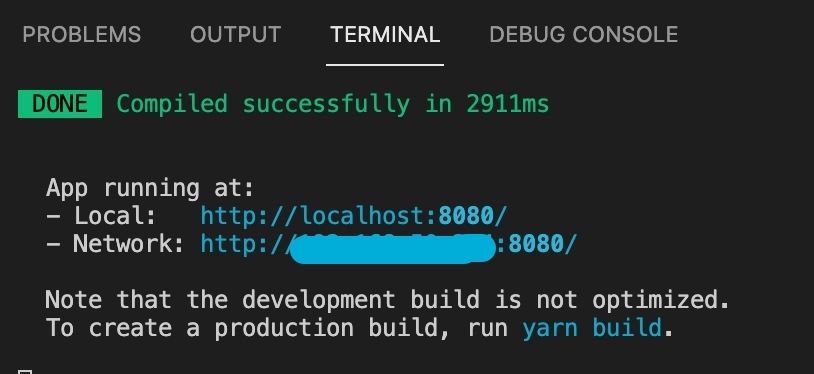
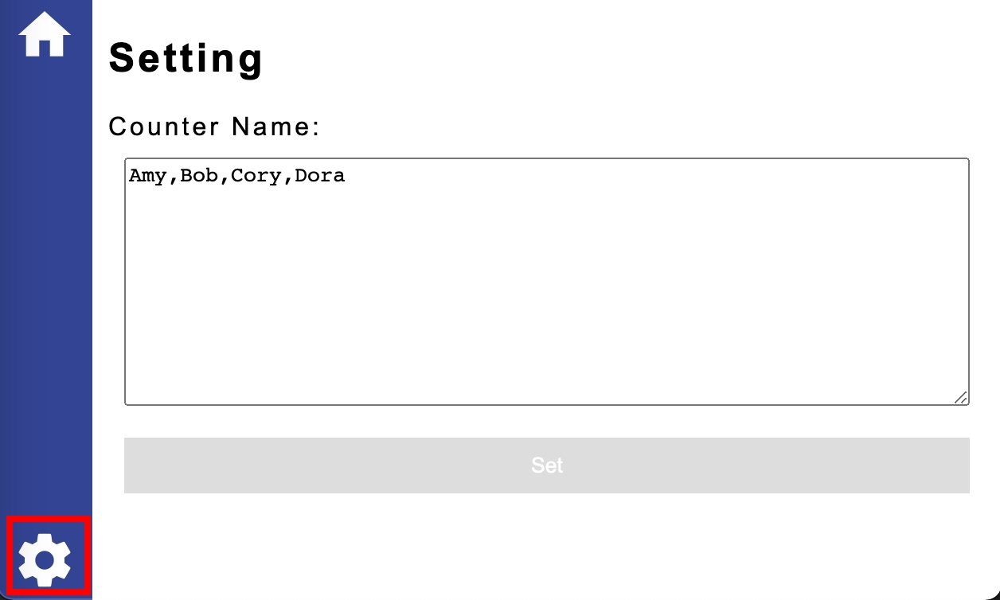
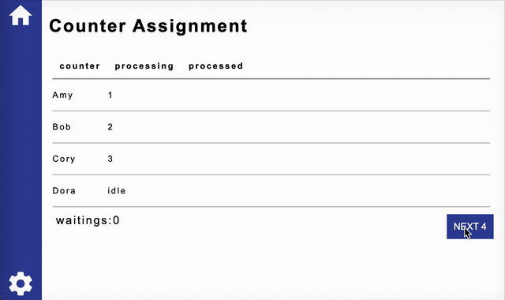

# Counter Assignment

## 如何執行
 * 可以使用vscode的終端機Terminal
 * 也可以於windows使用cmd 或 mac 使用terminal並將路徑指向程式資料夾後執行
### 1. 請先安裝需要的套件
```
> npm install
```
or 
```
> yarn install
```
### 2. 安裝完套件後執行程式
```
> npm run serve
```
or
```
> yarn serve
```
### 3. 執行成功後開啟頁面
 * 可以使用ctrl+滑鼠左鍵開啟頁面
 * 或者直接於瀏覽器輸入連結即可

 

### 4. 修改行員名稱，人數與行員的名稱一致
 1. 路徑於 src/models/counterName.json 更改靜態檔案的counters陣列
 2. 執行程式看到畫面後點擊左下角的設定圖示，即可看到如圖的畫面，這裡的行員名稱資料遇到特殊字元會自動捨去並轉為如圖的格式，可以直接換行或輸入空白來分開行員的名稱
    * 按鈕為藍色的時候才可以設定行員名稱，如果是灰色的時候代表資料未異動或是沒有輸入內容，此時按鈕不可使用
    * 按鈕為藍色時點擊後會彈出alert，代表設定成功
    * 設定頁面會將資料儲存於 sessionStorage，重整頁面也會保留紀錄，如果要改成讀取靜態檔案資料，請關閉頁面再開啟連結

  
 
### 5. 頁面功能說明
模擬櫃臺人員處理抽號碼牌的客戶時的情形，櫃檯人員處理每位客戶的時間設定為0.5~1.5秒之間，執行中的號碼會列在processing欄位中，若沒有在處理客戶則會顯示idle的文字，處理完後會顯示於processed欄位
  1. counter:行員名稱排列，會依據Setting頁面的行員名稱依序排序
  2. processing:目前處理的號碼為幾號，若沒有在處理會顯示idle
  3. processed:列出已處理的號碼
  4. waitings:等待人數
  5. Next按鈕:用於表示抽取號碼牌時下一位的號碼為多少，點擊後會依序給counter進行處理

 

### 6. 套件應用說明
 1. vue-router 管理頁面路徑以及使用layout來進行頁面的統一性
 2. lodash 簡化陣列及物件的程式碼應用
 3. sass 簡化css的符號並增加可讀性，並使用變數管理顏色提升效率